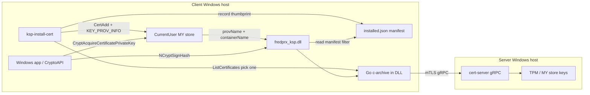

# CNG Key Storage Provider for tpm-cert-server

## Goal

Create a **remote-client CNG KSP** so Windows apps (`NCryptSignHash`, `certutil`, CryptoAPI consumers) can use TPM-backed keys on the cert-server host without local key material. The KSP mirrors [`cmd/example-client/main.go`](cmd/example-client/main.go): `ListCertificates` for enumeration, `SignHash` for signing.



## Architecture choice: C KSP + Go c-archive (not pure CGO KSP)

| Layer | Technology | Role |
|-------|------------|------|
| NCrypt surface | C DLL (adapted from [BlackICE `KSP.c`](BlackICE_Connect/BIC_CNG/CNG_Connector/src/KSP.c)) | Export `GetKeyStorageInterface`, implement `NCRYPT_KEY_STORAGE_FUNCTION_TABLE` |
| Remote backend | Go `c-archive` (reuse [`internal/tlsutil`](internal/tlsutil/tls.go), [`gen/cert/v1`](gen/cert/v1)) | gRPC client; linked into the KSP DLL as one binary |
| Registration | Go [`cmd/ksp-register`](cmd/ksp-register) | `BCryptRegisterProvider` / unregister (admin) |

**Why not fork all of BlackICE?** The upstream KSP pulls OpenSSL, libcurl, Azure REST, PIN auth, and encrypted config ([`CNG_Connector.vcxproj`](BlackICE_Connect/BIC_CNG/CNG_Connector/CNG_Connector.vcxproj)). We keep only the NCrypt boilerplate (~`KSP.c`, `KSPHelper.c`, `KSP.def`) and replace [`CNGStorage.c`](BlackICE_Connect/Modules/AKV_Module/src/CNGStorage.c) with a thin `tpmcert_storage.c` that calls the Go bridge.

**Why c-archive over two DLLs?** NCrypt loads the KSP into crypto processes; a single `fredprx_ksp.dll` avoids `LoadLibrary` path issues. Build with:

```powershell
go build -buildmode=c-archive -o build/tpmcertclient.a ./internal/kspclient
cl /LD ksp\*.c build/tpmcertclient.a ... /Fe:build/fredprx_ksp.dll
```

## API / proto extension (required for public-key export)

BlackICE builds `BCRYPT_RSAPUBLIC_BLOB` from AKV modulus/exponent in `ParseMemoryKey`. Our gRPC API today returns metadata only ([`proto/cert/v1/cert.proto`](proto/cert/v1/cert.proto)).

Add to `CertificateInfo`:

```protobuf
bytes certificate_der = 11;  // X.509 DER for public-key extraction + display
```

Wire in [`internal/winstore/store.go`](internal/winstore/store.go) (`cert.Raw`) and [`internal/server/service.go`](internal/server/service.go). Regenerate proto via [`scripts/gen-proto.ps1`](scripts/gen-proto.ps1).

The Go bridge parses DER → builds `BCRYPT_RSAPUBLIC_BLOB` (RSA) or returns `NTE_NOT_SUPPORTED` for unsupported algorithms in v1.

## Go bridge package: `internal/kspclient`

C header (generated + hand-maintained) exposing a minimal API:

```c
// tpmcertclient.h
int  tpmcert_init(const char* config_path);   // JSON config
void tpmcert_shutdown(void);
int  tpmcert_list_keys(/* out cert entries */);
int  tpmcert_sign_hash(const char* thumbprint, const uint8_t* digest, size_t digest_len,
                       int hash_alg, int rsa_padding, uint8_t* sig_out, size_t* sig_len);
void tpmcert_free(void* p);
```

Implementation reuses example-client flow:

- Config JSON (default `%ProgramData%\fredprx-ksp\config.json`):

```json
{
  "addr": "server.example.com:50051",
  "ca": "C:\\path\\ca.crt",
  "cert": "C:\\path\\client.crt",
  "key": "C:\\path\\client.key"
}
```

- Persistent gRPC connection with mutex (KSP may be called from multiple threads)
- `ListCertificates` cached briefly (e.g. 30s) to avoid hammering server on `NCryptEnumKeys`
- **Installed-keys manifest** at `%ProgramData%\fredprx-ksp\installed.json` — list of thumbprints the user chose to bind locally (written by install utility, read by KSP)
- `KSPEnumKeys` / `KSPOpenKey`: only expose thumbprints present in the manifest (strict mode — keys are not usable until installed)
- Key identity: **uppercase SHA-1 thumbprint** (matches server [`SignHash`](internal/server/service.go) lookup and `CERT_KEY_PROV_INFO.pwszContainerName`)
- Hash mapping: `SHA256/384/512` ↔ proto enums; padding: `BCRYPT_PAD_PKCS1` / `BCRYPT_PAD_PSS` ↔ proto `PKCS1`/`PSS`
- ECDSA: defer to v2 (`NTE_NOT_SUPPORTED` on non-RSA keys)

## C KSP layer: new `ksp/` directory

Adapt from BlackICE (Mozilla Public License — retain license headers):

| File | Source / purpose |
|------|------------------|
| [`ksp/ksp.def`](ksp/ksp.def) | Export `GetKeyStorageInterface` only |
| `ksp/ksp.h` | Trimmed `KSP.h` — remove AKV/OpenSSL includes |
| `ksp/ksp.c` | NCrypt function table + handlers; replace AKV calls with `tpmcert_*` |
| `ksp/ksp_helper.c` | From `KSPHelper.c` (handle validation, property helpers, list mgmt) |
| `ksp/tpmcert_storage.c` | Replaces `CNGStorage.c`: `Get_Key_List`, `Find_Next_Key`, `FindKeyInKeyStore`, `ParseMemoryKey` |

### Supported NCrypt operations (v1)

| Function | Behavior |
|----------|----------|
| `KSPOpenProvider` / `KSPFreeProvider` | Standard; init Go bridge on first open |
| `KSPEnumKeys` | List **installed** thumbprints from manifest; fetch metadata from cached remote list for display |
| `KSPOpenKey` | Open by thumbprint if present in manifest |
| `KSPSignHash` | Call `tpmcert_sign_hash` (PKCS1 + PSS, SHA-256/384/512) |
| `KSPExportKey` | Public key blob only (`BCRYPT_RSAPUBLIC_BLOB`) — non-exportable private key |
| `KSPGetKeyProperty` / `KSPGetProviderProperty` | Standard built-ins (length, algorithm, usage=sign) |
| `KSPCreatePersistedKey`, `KSPImportKey`, `KSPEncrypt`, `KSPDecrypt`, etc. | `NTE_NOT_SUPPORTED` |
| `KSPVerifySignature` | Local verify using cached public blob via `BCryptVerifySignature` (no round-trip) |

Provider name: **`Fred Proxy Key Storage Provider`**  
DLL name registered with CNG: **`fredprx_ksp.dll`**

## Certificate install utility: `cmd/ksp-install-cert`

Interactive CLI (same UX as [`cmd/example-client/main.go`](cmd/example-client/main.go)) that **selects one remote certificate and binds it to local KSP key material** on the target machine.

```
ksp-install-cert -addr ... -ca ... -cert ... -key ...
ksp-install-cert -list          # show currently installed bindings
ksp-install-cert -remove <thumbprint>   # uninstall cert + remove from manifest
```

### Flow

1. Connect to cert-server via mTLS gRPC (reuse [`internal/tlsutil`](internal/tlsutil/tls.go))
2. Call `ListCertificates`; prompt user to pick a cert (by number), same as example-client
3. Fetch `certificate_der` from selected entry
4. **Bind to KSP** — install into **Current User `MY`** with `CERT_KEY_PROV_INFO_PROP_ID`:

| Field | Value |
|-------|-------|
| `pwszProvName` | `Fred Proxy Key Storage Provider` |
| `pwszContainerName` | uppercase SHA-1 thumbprint |
| `dwProvType` | `0` (CNG KSP) |
| `dwKeySpec` | `AT_KEYEXCHANGE` or `AT_SIGNATURE` inferred from cert EKU / key usage |
| `dwFlags` | `0` (user store) |

5. Append thumbprint to `%ProgramData%\fredprx-ksp\installed.json` (dedupe; store subject + installed-at for `-list` display)
6. Print confirmation: thumbprint, subject, store path

### Implementation: `internal/kspinstall`

Go + `golang.org/x/sys/windows` (mirror patterns in [`internal/winstore`](internal/winstore)):

- `ParseCertificateDER(der []byte) (*x509.Certificate, error)`
- `BindCertificateToKSP(certDER []byte, thumbprint, providerName string, keySpec uint32) error`
  - `CertCreateCertificateContext` → `CertSetCertificateContextProperty(CERT_KEY_PROV_INFO_PROP_ID)` → `CertOpenStore(MY)` → `CertAddCertificateContextToStore(CERT_STORE_ADD_REPLACE_EXISTING)`
- `LoadManifest` / `SaveManifest` / `AddInstalled` / `RemoveInstalled`
- Shared manifest path helper with `internal/kspclient` config dir

After install, Windows apps resolve the private key via:

```
CryptAcquireCertificatePrivateKey(cert)
  → reads CERT_KEY_PROV_INFO
  → NCryptOpenStorageProvider("Fred Proxy Key Storage Provider")
  → NCryptOpenKey(container = thumbprint)
  → KSP KSPOpenKey → remote SignHash
```

### Uninstall

`-remove` deletes cert from MY by thumbprint (`CertFindCertificateInStore` + `CertDeleteCertificateFromStore`) and removes entry from manifest. Does not unregister the KSP.

## Registration tool: `cmd/ksp-register`

Go CLI (mirrors [BlackICE `CNG_Register`](BlackICE_Connect/BIC_CNG/CNG_Register/register.cpp)):

```
ksp-register -register | -unregister | -enum
```

- Calls `BCryptRegisterProvider`, `BCryptAddContextFunction`, `BCryptAddContextFunctionProvider`
- **Requires elevated admin**
- Post-register: copy `build/fredprx_ksp.dll` to `C:\Windows\System32\` (or document install path — CNG resolves by filename)

## Build script: `scripts/build-ksp.ps1`

Terminal-only build (no VS GUI required):

1. Locate MSVC via `vswhere` + `vcvars64.bat`
2. `go build -buildmode=c-archive` → `build/tpmcertclient.a` + `build/tpmcertclient.h`
3. `cl /LD /O2 ksp\*.c` link `tpmcertclient.a`, `bcrypt.lib`, `ncrypt.lib`, `crypt32.lib`
4. `go build -o build/ksp-register.exe ./cmd/ksp-register`
5. `go build -o build/ksp-install-cert.exe ./cmd/ksp-install-cert`
6. Output: `build/fredprx_ksp.dll`, `build/ksp-register.exe`, `build/ksp-install-cert.exe`

Add `build/` to [`.gitignore`](.gitignore).

## Testing plan

1. Start cert-server on remote host with TPM or software key in MY store
2. Generate mTLS certs (`go run ./cmd/gencerts`) on client; deploy config JSON
3. `build\ksp-register.exe -register` (admin) + copy DLL to System32
4. **Install binding**:

```powershell
build\ksp-install-cert.exe -addr server:50051 -ca certs\ca.crt -cert certs\client.crt -key certs\client.key
# pick cert interactively; verify:
build\ksp-install-cert.exe -list
certutil -user -store My
```

5. Verify KSP sees only installed key:

```powershell
certutil -csp "Fred Proxy Key Storage Provider" -key
```

6. **End-to-end sign via cert store** (not raw NCrypt thumbprint): small test that loads cert from MY by subject, calls `CryptAcquireCertificatePrivateKey` + `NCryptSignHash`; compare signature with `example-client` for same digest
7. Uninstall: `ksp-install-cert -remove <thumbprint>`; confirm cert gone from MY and KSP enum empty
8. `ksp-register -unregister` for cleanup

## README addition

Document in [`README.md`](README.md):

- KSP purpose (remote TPM keys via NCrypt)
- **Install workflow**: register KSP → run `ksp-install-cert` to bind chosen cert → apps use cert from MY store
- Config file format + installed-keys manifest
- Build (`scripts/build-ksp.ps1`), register (admin), install/uninstall cert bindings
- Limitations: RSA only v1, no key creation, Windows x64, keys not usable until explicitly installed

## Risk notes

- **Thread safety**: Go bridge must serialize gRPC calls or use connection-per-call with locking
- **Platform**: x64 only initially (match Go c-archive and modern TPM hosts)
- **BlackICE license**: Retain MPL headers on adapted files; do not copy NuGet/packages tree
- **PSS in BlackICE**: Upstream `KSPSignHash` is PKCS1-centric; we implement PSS explicitly to match server capabilities
