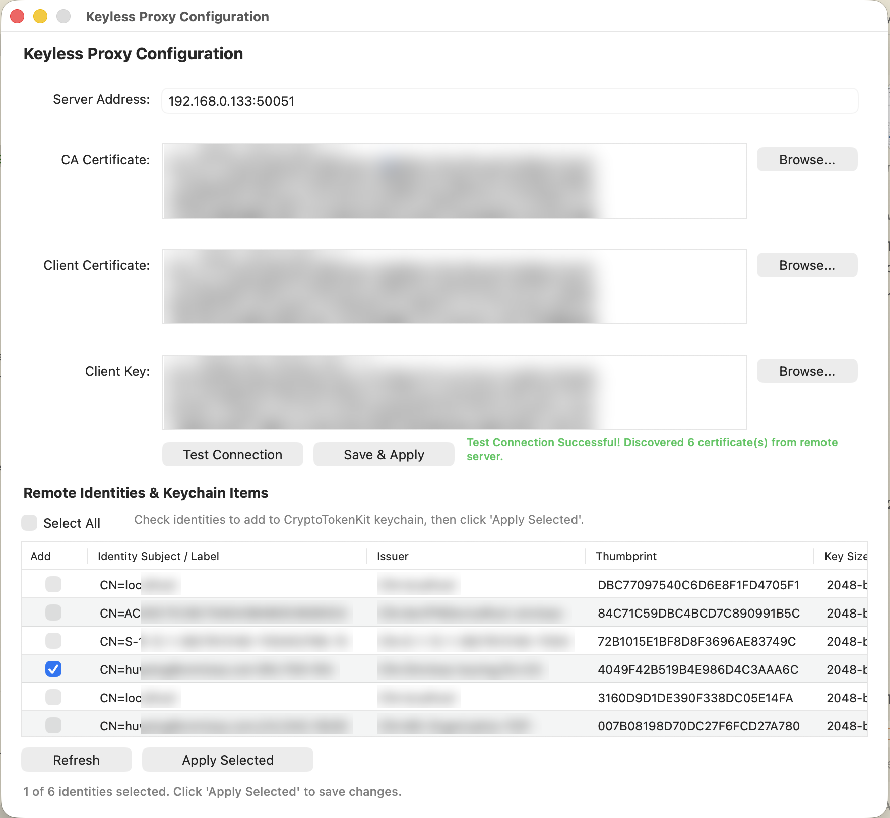

# Keyless TLS Proxy

A cross-platform gRPC service and client proxy architecture for **Windows** and **macOS** that lists certificates with private keys from system certificate stores (Windows `MY` store via CNG/NCrypt, macOS Keychain) and performs remote keyless signing of digests using non-exportable keys (including TPM-backed keys and hardware tokens). Communication between clients and servers is secured with mutual TLS (mTLS).

## Key Features

- **Cross-Platform Server (`cmd/cert-server`)**: Runs on both **macOS** (accessing macOS Keychain) and **Windows** (accessing Windows `MY` store / NCrypt / TPM).
- **macOS Provider App & Extension (`mac-provider/`)**: Native macOS App (`KeylessProxy`) and CryptoTokenKit (CTK) SmartCard Token extension (`KeylessProxyExtension`) allowing macOS systems and applications to delegate cryptographic signing to a remote `cert-server`.
- **Windows CNG KSP (`ksp/`)**: Custom Windows Key Storage Provider DLL that integrates with Windows CryptoAPI/CNG to delegate signing to a remote `cert-server`.
- **UDP LAN Discovery**: Automatic server discovery over LAN via UDP broadcast on port 6666.
- **mTLS Transport Security**: Full mutual TLS authentication for gRPC communication between clients/providers and the cert-server.

## Requirements

- **Server Host**: Windows 10/11 / Windows Server OR macOS 12+
- **macOS Provider App / Extension**: macOS 12+, Xcode / Xcode Command Line Tools, and `xcodegen` (`brew install xcodegen`)
- **Windows CNG KSP**: Windows 10/11 (C++ build tools and CGO required to compile)
- **Go**: 1.26+
- **Protobuf**: `protoc` (bundled under `tools/protoc/` after bootstrap, or install via `brew install protobuf` / `winget install Google.Protobuf`)

## Quick Start

### 1. Generate mTLS transport certificates

```bash
go run ./cmd/gencerts
```

This creates `certs/ca.crt`, `certs/server.crt`, `certs/server.key`, `certs/client.crt`, and `certs/client.key`.

### 2. Start the certificate server

The server can run on **macOS** (reading from Keychain) or **Windows** (reading from `MY` store).

**On macOS / Linux:**
```bash
go run ./cmd/cert-server \
  -addr 127.0.0.1:50051 \
  -ca certs/ca.crt \
  -cert certs/server.crt \
  -key certs/server.key
```

**On Windows (PowerShell):**
```powershell
go run ./cmd/cert-server `
  -addr 127.0.0.1:50051 `
  -ca certs/ca.crt `
  -cert certs/server.crt `
  -key certs/server.key
```

The server listens on localhost by default and requires a valid client certificate.

UDP broadcast discovery is enabled by default on port **6666** (`-discovery-addr :6666`). Clients on the same LAN can find the server without hard-coding its IP.

To bind gRPC to a reachable network interface for LAN clients:
```bash
go run ./cmd/cert-server \
  -addr 0.0.0.0:50051 \
  -ca certs/ca.crt \
  -cert certs/server.crt \
  -key certs/server.key
```

Disable discovery with `-discovery=false`. Windows Firewall or macOS Application Firewall may require allowing inbound UDP on port 6666 and TCP on 50051.

**Discovery protocol:** send a UDP broadcast (or unicast) to port 6666:
```json
{"op":"discover","service":"tpm-cert-server"}
```

The server replies with:
```json
{"op":"announce","service":"tpm-cert-server","version":"1","hostname":"HOST","grpc_addr":"192.168.1.50:50051"}
```

Discover servers on the LAN:
```bash
go run ./cmd/run-discovery
```

### 3. Run the example client

```bash
go run ./cmd/example-client \
  -addr 127.0.0.1:50051 \
  -ca certs/ca.crt \
  -cert certs/client.crt \
  -key certs/client.key
```

The client will:
1. List all certificates on the server (from macOS Keychain or Windows `MY` store) that have accessible private keys
2. Prompt you to choose a certificate by index
3. Prompt for text to sign (or pass `-message "hello"`)
4. Compute SHA-256 locally and call `SignHash` on the server
5. Print the digest and signature

## macOS Provider (App & CryptoTokenKit Extension)



The macOS integration provides a native GUI application (`KeylessProxy`) and a CryptoTokenKit (CTK) SmartCard extension (`KeylessProxyExtension`). This allows macOS applications, system authentication, and TLS clients to use remote certificates hosted by `cert-server` as if a smart card were inserted locally.

### Build and Install on macOS

1. Install prerequisites:
   ```bash
   brew install xcodegen
   ```

2. Build the app and extension bundle:
   ```bash
   ./scripts/build-app-bundle.sh
   ```

3. Install to `/Applications` and register the extension:
   ```bash
   ./scripts/install-app-mac.sh
   ```
   This script builds `KeylessProxy.app`, copies it to `/Applications/KeylessProxy.app`, registers the CTK extension (`KeylessProxyExtension.appex`) using `pluginkit`, and initializes driver configuration.

### How it works on macOS
- `KeylessProxy.app` provides a UI to configure connection parameters (server address, mTLS certificates, selected identities) and saves shared configuration for the extension.
- `KeylessProxyExtension.appex` uses `internal/ctkbridge` (a Go `c-archive` bridge) to communicate with the remote `cert-server` via mTLS gRPC when macOS requests signature operations.

## Windows CNG Key Storage Provider (KSP)

The KSP lets Windows applications on a **client machine** use TPM-backed or store keys hosted on a remote `cert-server` via NCrypt/CryptoAPI. Private keys never leave the server; the KSP forwards signing requests to `cert-server` over mTLS gRPC.

### Build on Windows

Requires Go 1.26+, Visual Studio C++ build tools, and CGO (`CGO_ENABLED=1`):

```powershell
powershell -ExecutionPolicy Bypass -File scripts/build-ksp.ps1
```

Outputs in `build/`:
- `fredprx_ksp.dll` — CNG Key Storage Provider
- `ksp-register.exe` — register/unregister the provider (admin)
- `ksp-install-cert.exe` — install and bind a remote certificate

### Install workflow

1. Copy `build\fredprx_ksp.dll` to `C:\Windows\System32`
2. Register the provider (elevated Prompt):
   ```powershell
   build\ksp-register.exe -register
   ```
3. Install a remote certificate binding (uses mTLS certificates):
   ```powershell
   build\ksp-install-cert.exe `
     -addr server.example.com:50051 `
     -ca certs\ca.crt `
     -cert certs\client.crt `
     -key certs\client.key
   ```
   This writes `%ProgramData%\fredprx-ksp\config.json`, prompts to select a certificate, installs it into **Current User\MY**, and records the thumbprint in `%ProgramData%\fredprx-ksp\installed.json`.
4. Windows applications can now acquire the private key via `CryptAcquireCertificatePrivateKey`; signing is delegated to `cert-server`.

### Manage KSP bindings

```powershell
build\ksp-install-cert.exe -list
build\ksp-install-cert.exe -remove <THUMBPRINT>
build\ksp-register.exe -unregister
```

## Project Layout

| Path | Description |
|------|-------------|
| `proto/cert/v1/cert.proto` | gRPC API definition |
| `gen/cert/v1/` | Generated protobuf/gRPC Go code |
| `internal/certstore/` | Platform certificate store enumeration and signing (Windows NCrypt & macOS Keychain) |
| `internal/server/` | gRPC service implementation and UDP discovery |
| `internal/tlsutil/` | mTLS configuration helpers |
| `internal/ctkbridge/` | Go c-archive exports linked into macOS CTK provider |
| `internal/kspclient/` | gRPC client library for Windows KSP bridge |
| `cmd/cert-server/` | Cross-platform gRPC server entrypoint (macOS & Windows) |
| `cmd/example-client/` | Interactive example client |
| `cmd/run-discovery/` | UDP LAN discovery client |
| `cmd/gencerts/` | Dev mTLS CA/server/client certificate generator |
| `cmd/local-sign-test-mac/` | macOS local Keychain signing test utility |
| `cmd/local-sign-test-win/` | Windows local CNG signing test utility |
| `cmd/ksp-register/` | Register/unregister the Windows CNG KSP (admin) |
| `cmd/ksp-install-cert/` | Install a remote cert into Windows MY store and bind to KSP |
| `ksp/` | Windows CNG Key Storage Provider DLL sources |
| `mac-provider/` | macOS GUI App (`KeylessProxy`) and CryptoTokenKit (CTK) extension (`KeylessProxyExtension`) sources |
| `scripts/build-app-bundle.sh` | Build macOS app and extension bundle via `xcodegen` and `xcodebuild` |
| `scripts/install-app-mac.sh` | Install macOS app bundle to `/Applications` and register CTK plugin |
| `scripts/build-release-artifacts.sh` | Build all release binaries/zips and optionally publish to GitHub |
| `scripts/gen-proto.ps1` | Regenerate protobuf code |
| `scripts/build-ksp.ps1` | Build Windows KSP DLL and helper tools |

## gRPC API

- **ListCertificates** — returns thumbprint, subject, issuer, validity, key type/size, TPM flag, provider name, and certificate DER
- **SignHash** — signs a pre-computed digest (SHA-256, SHA-384, or SHA-512) with the certificate identified by thumbprint; RSA keys support `pkcs1` (default) or `pss` padding via `rsa_padding`

## TPM & Key Security Notes

- On Windows, certificates using **Microsoft Platform Crypto Provider** are flagged as `is_tpm=true`. TPM keys are non-exportable and signed in-place via `NCryptSignHash`.
- On macOS, certificates stored in system or user keychains with non-exportable private keys are accessed via Security framework APIs.
- RSA signing supports PKCS#1 v1.5 (default) and PSS (`-padding pss` on the example client).

## Regenerating Protobuf Code

```bash
# Windows
powershell -ExecutionPolicy Bypass -File scripts/gen-proto.ps1

# macOS / Linux (if protoc & plugins installed)
protoc --go_out=. --go_opt=paths=source_relative \
  --go-grpc_out=. --go-grpc_opt=paths=source_relative \
  proto/cert/v1/cert.proto
```

## Security

- mTLS transport certs (`cmd/gencerts`) are separate from signing certificates.
- The server defaults to `127.0.0.1` — bind to a broader interface only in trusted networks.
- `certs/` is gitignored; regenerate for each environment.

## License

This project is licensed under the Apache License 2.0 - see the [LICENSE](LICENSE) file for details.


